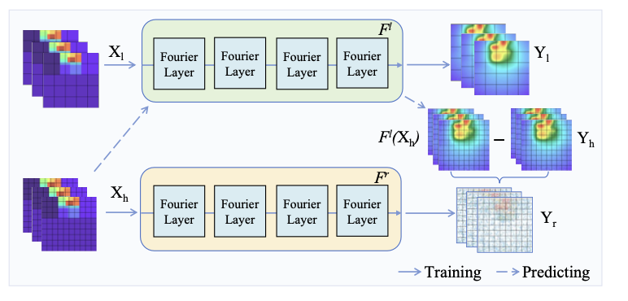
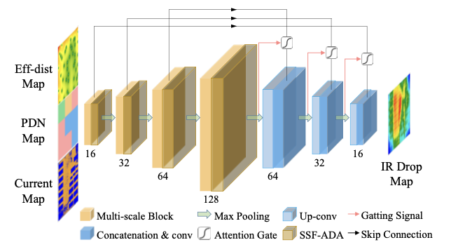








Mingyue Wang is a final year master's student at BeiHang University.

I am eager to contribute to research in areas such as, but not limited to:
- **Multi-modal Large Language Model (MLLM)**
- **The Application of LLM**
- **AI for Electronic Design Automation (EDA)**

I will be graduating on July 1, 2025, and am available to start employment immediately. 

Open to discussions or collaborations，please feel free to [email me](mailto:chococolate0901@outlook.com) if interested.

# 📝 Selected Publications
See the full list at [Google Scholar](https://scholar.google.com/citations?user=YUun97AAAAAJ).

ICCAD 2024

[ARO: Autoregressive Operator Learning for Transferable and Multi-fidelity 3D-IC Thermal Analysis with Active Learning]

**Mingyue Wang**, Yuanqing Cheng, Weiheng Zeng, Zhenjie Lu, Vasilis F.Pavlidis, Wei W.Xing  

<a href="https://dl.acm.org/doi/pdf/10.1145/3676536.3676713">Paper</a>, <a href="https://github.com/Mia-WMY/ARO">Code</a>  

ICCAD'24: Proceedings of the 43rd IEEE/ACM International Conference on Computer-Aided Design.

DAC 2024

[MAUnet: Multiscale Attention U-Net for Effective IR Drop Prediction]
**Mingyue Wang**, Yuanqing Cheng, Yage Lin, Kelin Peng, Shunchuan Yang, Zhou Jin, Wei W.Xing  

<a href="https://dl.acm.org/doi/10.1145/3649329.3658465">Paper</a>, <a href="https://github.com/Mia-WMY/MAUnet">Code</a>, <a href="../images/maunet_poster.pdf">Poster</a>   

DAC '24: Proceedings of the 61st ACM/IEEE Design Automation Conference

# 💻 Internships

- *2024.11 - now*: Baidu, Beijing, China.

  

    
    <!-- 
Company 1
 -->
  

# 🎖 Honors and Awards
- *2024* National Scholarship. 
- *2024* Excellent Graduate Student. 
- *2023* Master's Second-Class Academic Scholarship. 

# 📖 Educations
- *2022.09 - 2025.06 (now)*, School of Integrated Circuit Science and Engineering, BeiHang University (BUAA).
- *2018.09 - 2022.06*, School of Computer and Cyberspace Security, Communication University of China (CUC).  

<!-- # Academic Services
- *2021.06*, Lorem ipsum dolor sit amet, consectetur adipiscing elit. Vivamus ornare aliquet ipsum, ac tempus justo dapibus sit amet. 
- *2021.03*, Lorem ipsum dolor sit amet, consectetur adipiscing elit. Vivamus ornare aliquet ipsum, ac tempus justo dapibus sit amet.  \| [\[video\]](https://github.com/) -->

  

  End Line
  

  

